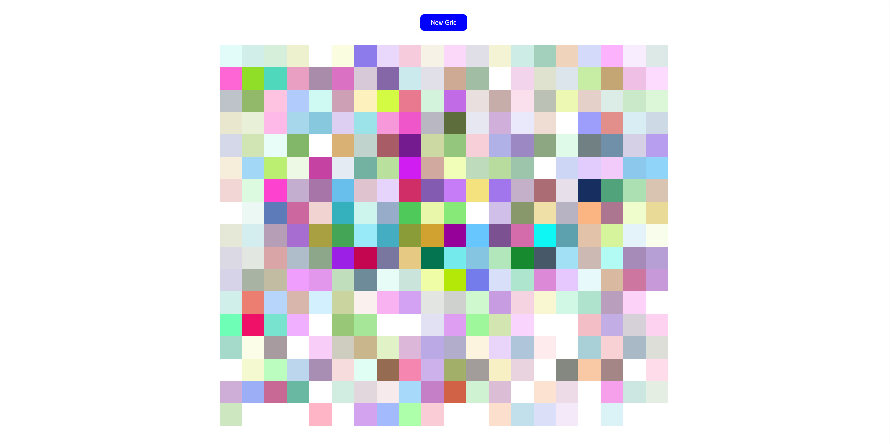

# Odin Project: Etch-a-Sketch

This project is a browser-based Etch-a-Sketch application built as part of [The Odin Project](https://www.theodinproject.com/) curriculum. The goal of the project is to practice DOM manipulation, JavaScript event handling, and dynamic HTML/CSS rendering.

## Features

- **Interactive Grid:** Draw by hovering over the grid squares with your mouse.
- **Customizable Size:** Change the grid size to increase or decrease drawing resolution.
- **Reset Functionality:** Clear the grid at any time to start a new drawing.
- **Color Modes:** Includes standard black drawing, RGB color mode, and eraser mode.
- **Responsive Design:** Works on various screen sizes for ease of use.

## Getting Started

1. **Clone the repository:**
   ```bash
   git clone https://github.com/ruslan898/odin-project_etch-a-sketch.git
   ```
2. **Open `index.html` in your browser.**
3. **Start sketching!**

## Technologies Used

- HTML5
- CSS3
- JavaScript (ES6)

## Screenshots



## Project Objectives

- Practice DOM manipulation and event listeners in JavaScript.
- Get comfortable with CSS Grid for layout.
- Learn to build interactive, user-driven interfaces.

## Credits

This project is part of [The Odin Project](https://www.theodinproject.com/) Foundations course.

---

Happy sketching!